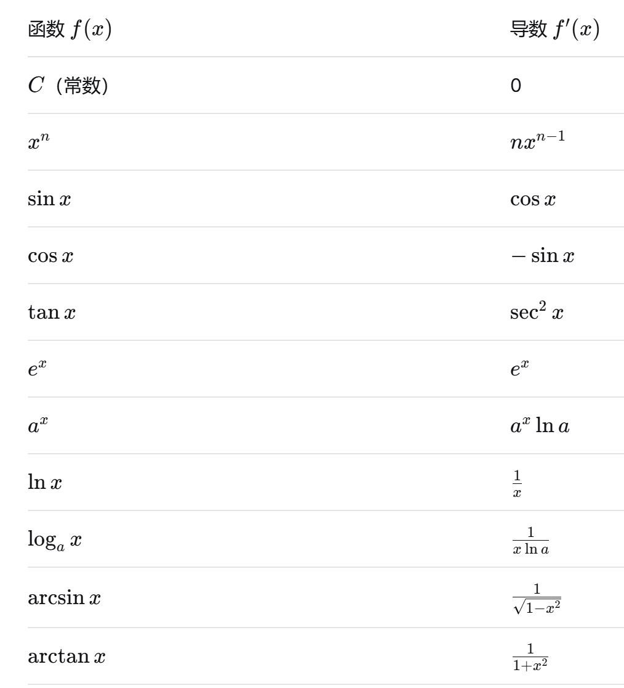

## 导数
### 定义
#### 1.1 直观的理解
- 求导 = 求瞬时变化率 = 切线的斜率
- 物理意义：路程对时间的导数=瞬时速度
- 几何意义：函数图像上某点切线的斜率

#### 1.2 定义
- $f'(x) = \lim_{\Delta x \to 0} \frac{f(x+\Delta x) - f(x)}{\Delta x}$
- 这个极限存在，则称函数可导

### 求导
#### 2.1 基本求导公式
- 注： 必须熟记于心

#### 2.2 求导法则
1. 四则运算
    $$ (u + v)' = u' + v' $$
    $$ (uv)' = u'v + uv' $$
    $$ \left( \frac{u}{v} \right)' = \frac{u'v - uv'}{v^2} $$
2. 链式法则
    $$ \frac{dy}{dx} = \frac{dy}{du} \cdot \frac{du}{dx} $$
3. 隐函数求导
   - 方程两边同时对x求导，把y视为x的函数
4. 对数求导法
   $$ y = [u(x)]^{v(x)} $$

#### 2.3 典型例子
- $$ y = x^2 \cdot \ln x $$ 
- $$ y' = (x^2)' \ln x + x^2 (\ln x)' = 2x \ln x + x^2 \cdot \frac{1}{x} = 2x \ln x + x $$ 
- $$ y = e^{3x+1} $$ 
- $$ y' = e^{3x+1} \cdot (3x+1)' = e^{3x+1} \cdot 3 = 3e^{3x+1} $$ 

#### 2.4 常见错误
- ❌忘记链式反应(内层函数不求导)
- ❌分数求导直接分子分母分别求导（正确的时商法则）