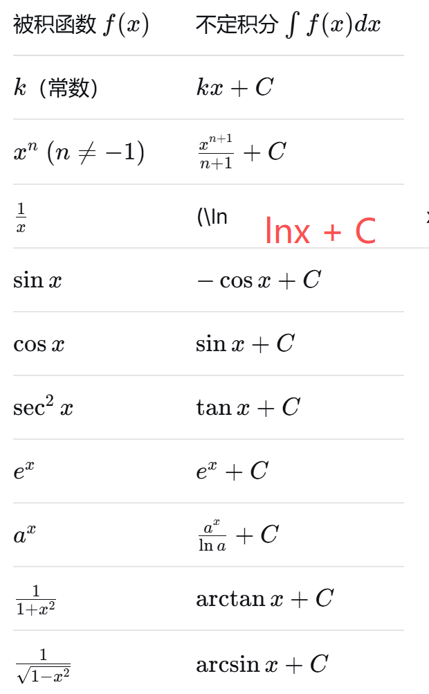

## 积分
### 一、定义
#### 1.1 不定积分和定积分
1. 不定积分——求原函数
   - ∫f(x)dx=F(x)+C,其中 F′(x)=f(x)
2. 定积分——求面积和累计和
   $$ \int_a^b f(x) \, dx = F(b) - F(a)$$

### 二、积分
#### 2.1 积分公式

#### 2.2 积分方法
> 由易到难
1. 直接积分
   $$ \int [3x^2 + \cos x] \, dx = 3 \cdot \frac{x^3}{3} + \sin x + C = x^3 + \sin x + C $$
2. 凑微分（第一类换元）
   - 核心： ∫f(g(x))g′(x)dx=∫f(u)du, u=g(x)
3. 第二类换元（去掉根号）
4. 分部积分（最重要之一）
   - ∫udv=uv−∫vdu
   - 口诀：反对幂指三（靠前者设为 u，靠后者设为 dv）
5. 有理函数积分（部分分式）
   - 将真分式拆成简单分式之和
#### 2.3 定积分的计算和性质
1. 牛顿-莱布尼茨公式
   $$ \int_a^b f(x) \, dx = F(b) - F(a) $$ 
2. 几何意义
   - f(x)≥0 时为曲边梯形面积
3. 性质
   - 积分上下限互换性质
     $$ \int_a^b f(x) \, dx = -\int_b^a f(x) \, dx $$
   - 线性性质（加减）
     $$ \int_a^b [f(x) \pm g(x)] \, dx = \int_a^b f(x) \, dx \pm \int_a^b g(x) \, dx $$
   - 区间可加性
     $$ \int_a^b f(x) \, dx = \int_a^c f(x) \, dx + \int_c^b f(x) \, dx $$
   - 对称区间，奇函数积分为0，偶函数积分为2倍
### 三、 定积分应用
#### 3.1 面积
$$ A = \int_a^b [f(x) - g(x)] \, dx \quad (f(x) \geq g(x)) $$

#### 3.2 旋转体体积
- 绕x轴
$$ V = \pi \int_a^b [f(x)]^2 \, dx $$
- 绕y轴
$$ V = 2\pi \int_a^b x f(x) \, dx $$ 

#### 3.3 弧长公式
$$ L = \int_a^b \sqrt{1 + [f'(x)]^2} \, dx $$ 

### 四、注意事项
- ❌ 不定积分忘记写 +C
- ❌ 认为$\int \frac{1}{x} \, dx = \ln |x| + C$ (漏掉绝对值：ln∣x∣+C)
- ❌ 混淆$\int \frac{1}{x^2} \, dx = \frac{x^{-1}}{-1} = -\frac{1}{x} + C$(正确)与$\int \frac{1}{x} \, dx$（特殊）
- ❌ 换元积分不换回原变量
- ❌ 定积分换元时忘记换积分上下限